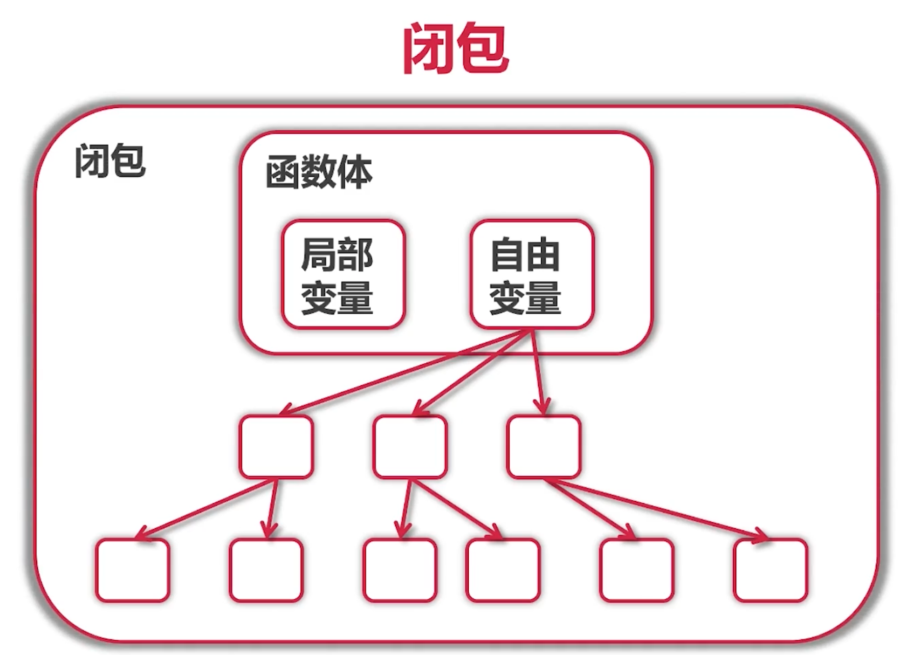

# ccmouse慕课网视频（Google资深工程师深度讲解Go语言）
[课程地址](https://coding.imooc.com/class/chapter/180.html#Anchor)
## 环境
* Go1.13
## 1-3 国内镜像配置
* go env -w GOPROXY=https://goproxy.io,direct
* go env -w GO111MODULE=on
## 1-4 IntelliJ Idea 的安装和配置
### Idea 编辑器
* 安装插件go
* 安装goimports
  * go get ...
* 安装插件file watcher
  * 添加 goimports
* 隐藏参数提示（对java有用，go不太有用）
  * parameter hint
    * show parameter name hints 取消勾选
### Goland 编辑器
* editor/code style/go/sorting type/选择 goimports(默认是gofmt)
* 隐藏参数
  * show parameter hints/去掉 GO

### mac Goland编辑器的Go环境配置
* GOROOT
  * /usr/local/go
* GOPATH
  * /Users/samzhou/Desktop/studycode/studygo/gopath
* Go Modules
  * GOPROXY=https://goproxy.io,direct;GO111MODULE=on
## 2-3 常量与枚举
* consts 数值可以作为各种类型使用
  * consts filename = "abc.txt"  // 不定义类型
  * 枚举 iota
* rune 字符串类型 int32别名
## 2-6 函数
* 可变参数
  * 例子 func sum(numbers ...int)
    * sum(1,2,3)
## 2-7 指针
* 值传递 引用传递
* go语言只有值传递
## 3-1 数组
## 3-2 切片的概念
## 3-3 切片的操作
```
创建
s1 := []int{2,4,6,8}
s2 := make([]int, 10, 32)
复制
copy(s2, s1)
删除[3]
s2 = append(s2[:3], s2[4:]...)
```
## 3-4 Map
* 除了slice,map,function的内建类型都可以作为key
* Struct不包含上述类型，也可以作为key
```
创建
make(map[string]int)
获取元素
m[key]
  key不存在是时候不报错，获得Value类型的零值
判断key是否存在
if name, ok := m["name"]; ok {
  fmt.Println(name)
}
```
## 3-5 Map例题
## 3-6 字符和字符串处理
```
s := "Yes我爱慕课网!"
for i, ch := range []rune(s) {
    fmt.Printf("(%d, %c )", i, ch)
}

(0, Y )(1, e )(2, s )(3, 我 )(4, 爱 )(5, 慕 )(6, 课 )(7, 网 )(8, ! )
```
## 4-1 结构体和方法
* 只有指针才可以改变结构内容
* nil指针也可以调用方法！
## 4-2 包和封装
* 每个目录只有一个包
## 4-3 扩展已有类型
* 组合 和 别名
## 4-4 使用内嵌来扩展已有类型
* 定义别名：最简单
* 使用组合：最常用
* 使用内嵌：省下许多代码
## 5-1 依赖管理
## 5-2 GOPATH 和 GOVENDOR
* 关闭go mod，使用系统变量修改export GO111MODULE=off，go env -w修改会修改全局
* 每个项目独立第三方包配置：在每个项目中创建vendor，各自管理依赖包，最好需要使用第三方包管理
## 5-3 go mod的使用
* 增加依赖(go get)
  * go get -u go.uber.org/zap@1.24
    * 不加版本，默认最新
* 更新依赖
  * go get [@v...]   再运行整理命令：go mod tidy
    * 使用命令，而不是修改go.mod
      * go get -u go.uber.org/zap@v1.23
        * 显示：go: downgraded go.uber.org/zap v1.24.0 => v1.23.0
* 整理go.mod内容
  * go mod tidy  # 作用如下
    * 项目中使用到的模块，添加到mod
    * 清理不需要的模块
    * 清理go.sum中不使用的
### gopath或govendor项目迁移到go mod
* 初始化
  * go mod init [module]
* 往mod中添加模块
  * go mod tidy
## 5-4 目录的整理
### go build
* go build
  * 当前目录生成可执行文件
* go build ./...
  * 检测所有子目录下main包是否可以编译通过
### go install
* go install
  * 会把main包的生成可执行命令，放在$GOPATH/bin下
*go install ./...
  * 当前目录下所有子目录有main包的都会生成可执行文件
## 6-1 接口的概念
* 接口一般使用er结尾
## 6-2 duck typing的概念
## 6-3 接口的定义和实现
* (下层)实现方 定义struct和方法
* (上层)使用者 定义接口中包含的方法
* 下层struct中包含接口定义的方法，这个struct实例就是这个接口的类型
## 6-4 接口的值类型
* 接口变量有什么


* 接口内部有两个内容
  * 1、类型
    * 获取类型：接口实例.(type)
  * 2、值
    * 获取值：接口实例.(接口类型).struct属性 (Type assertion)
      * 断言 Type assertion
        ```
        if i, ok := 接口实例.(接口类型); ok {
          接口实例.属性 ...
        }
        ```

* 定义任何类型：interface{}
  * type Queue []interface{}
* 强制限定值的类型，例如限制v的类型为int：v.(int)
## 6-5 接口的组合
```
type ReaderWriter interface {
  Reader
  Writer
}
```
## 6-6 常用系统接口
## 7-1 函数式编程
* 闭包

## 7-2 函数式编程例一
## 7-3 函数式编程例二
## 8-1 defer调用
### 何时使用defer调用
* Open/Close
* Lock/Unlock
* PrintHeader/PrintFooter
## 8-2 错误处理概念
### error 内置接口，有个方法Error返回string
```
type error interface {
	Error() string
}
```
* 打印错误
```
fmt.Println("Error:", err.Error())
fmt.Println("Error:", err)  // 会自动找到错误信息

输出：Error: open fib.txt: file exists
```

### 错误断言
* 判断错误类型
```
file, err := os.OpenFile(filename, os.O_EXCL|os.O_CREATE, 0666)
if err != nil {
    if pathError, ok := err.(*os.PathError); !ok {
        panic(err)
    } else {
        fmt.Println(pathError.Op, pathError.Path, pathError.Err)
    }
    return
}
```
## 8-3 服务器统一出错处理
## 8-4 panic和recover
## 8-5 服务器统一出错处理2


## 17-3 Docker的安装和使用
### 安装elasticsearch
* [安装文档](https://www.elastic.co/guide/en/elasticsearch/reference/7.17/docker.html)
```
docker pull docker.elastic.co/elasticsearch/elasticsearch:7.17.9
docker run -p 127.0.0.1:9200:9200 -p 127.0.0.1:9300:9300 -e "discovery.type=single-node" docker.elastic.co/elasticsearch/elasticsearch:7.17.9
或者
docker pull elasticsearch:7.17.9
docker run -p 127.0.0.1:9200:9200 -p 127.0.0.1:9300:9300 -e "discovery.type=single-node" elasticsearch:7.17.9
```
## 17-4 ElasticSearch入门
* <server>:9200/index/type/id
  * index -> database
  * type -> table
* 全文搜索
  * <server>:9200/<index>/<type>/_search?q=全文搜索

