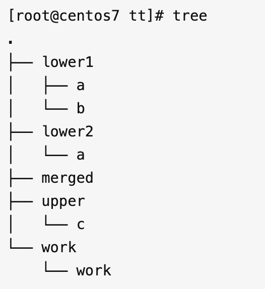

# 07白话容器基础（三）：深入理解容器镜像
## 联合文件系统 overlay (音频中是aufs，centos8不支持，这个使用overlay)
[overlay教程](https://zhuanlan.zhihu.com/p/589492844)


```shell
mount -t overlay overlay -o lowerdir=lower1:lower2,upperdir=upper,workdir=work merged
```
可以看到，从merged视角，位于lower2的a文件被lower1的a文件覆盖；b文件位于lower1，c文件位于upper，符合从高到低upper->lower1->lower2的层次结构。
在merged目录添加一个文件d, upper目录自动会对应增加文件d。
