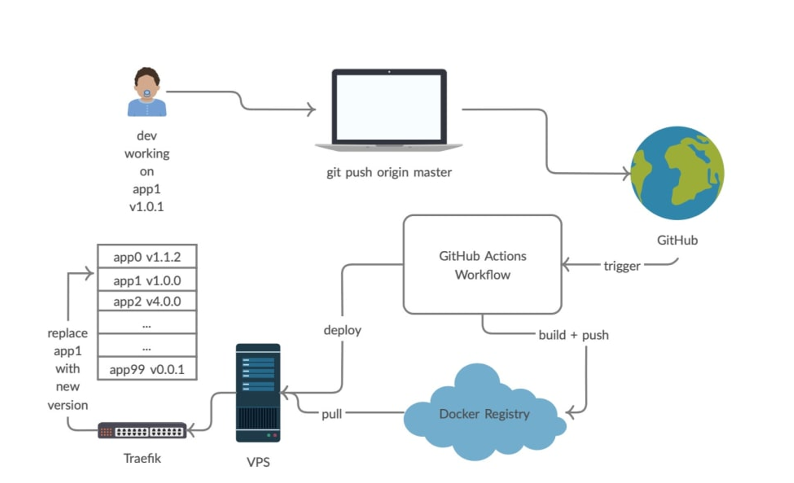

# Docker系统性入门+进阶实战（2021最新版）慕课网

## docker文档（视频中的）
[docker totarial](https://dockertips.readthedocs.io/en/latest/)

## 安装docker
linux上安装，[下载shell文件](https://get.docker.com/)在服务器上运行
```
下载
# curl -fsSL https://test.docker.com -o test-docker.sh
安装
# sh test-docker.sh
启动
# systemctl start docker

# 配置docker源
[root@nginx ~]# cat /etc/docker/daemon.json
{
  "exec-opts": ["native.cgroupdriver=systemd"],
  "registry-mirrors": [
    "http://hub-mirror.c.163.com",
    "https://docker.mirrors.ustc.edu.cn"
    ]
}
```

## docker快速上手
### docker基础命令

#### image命令
```
docker image pull image:tag  # 拉取image
docker image ls  # 查看image
docker image ls -q  # 查看image的id
docker image rm image-id  # 删除image
docker image tag IMAGE:TAG NEW-IMAGE:TAG  # 创建tag
docker image history IMAGE  # 查看分层
docker image inspect IMAGE  # 查看详情
docker image prune -a  # 删除不在使用的image
docker search IMAGE  # 查看dockerhub上的镜像

docker login # 登陆dockerhub
docker image push samzhou/image:tag  # 上传image到dockerhub

docker manifest inspect samzhou/flask-redis:latest  # 查看dockerhub上镜像信息

docker biuldx  # 多架构构建镜像
```

#### container命令
```
docker container run -it busybox  # 运行容器，交互式运行(-it)，退出话，容器也会结束
docker container run -d image:tag  # 运行容器，后台运行(-d)
docker container exec -it 容器id sh # 以交互式(-it)进入容器，运行sh命令
docker container --rm IMAGE 命令  # 执行好后，删除container

docker container ls  # 查看运行的容器
docker container ls -a  # 查看所有的容器，包括停止的
docker container top container-id  # 查看容器top
docker container logs container-id  # 查看容器日志
docker container inspect CONTAINER # 查看容器详情，比如ip

docker container stop container-id  # 停止容器
docker container stop $(docker container ls -q)  # 批量停止
docker contianer rm container-id  # 删除容器

docker container commit container-id image:tag  # 通过容器创建image

```

### 其他命令

```
docker system prune -f  # 删除不在使用的资源（容器、网络、构建时缓存）
```


### docker命令基础例子
```
下载image从register
docker image pull nginx:1.21.0-alpine

创建tag
docker image tag nginx:1.21.0-alpine ng

运行image，端口暴露80(宿主机端口:容器端口) -d 后台运行
docker container run -d -p 80:80 ng

宿主机上访问
127.0.0.1:80
```


### docker进程
```
在宿主机上查看nginx容器进程
# docker run -d nginx

# ps aux|grep nginx

# docker container top f2d

# pstree -halps 13327
systemd,1 --switched-root --system --deserialize 18
  `-containerd-shim,13254 -namespace moby -id f2dcfeb39f5ccb3545ccf1c93cc3dd69a3f1328e300e3f3bc34acd0f0520dded -address /run/containerd/containerd.sock
      `-nginx,13274
          `-nginx,13327
```

## Dockerfile
### 基础镜像原则
* 官方的，或Dockerfile开源的
* 固定tag，而不是每次都用latest
* 体积小的

### Dockerfile例子
Dockerfile文件
```
FROM nginx:1.21.0-alpine
ADD index.html /usr/share/nginx/html/index.html
```
index.html文件

```
<h1>Hello Nginx</h1>
```
创建image(默认tag:latest)

```
docker image build -f Dockerfile -t hello .
```


### Dockerfile书写
* RUN 尽量写在一起，减少层数，体积会小
* COPY 复制文件，一般使用这个
* ADD 复制文件，如果是压缩包会解压
* WORKDIR 目录切换，目录不存在会创建
* ENV 环境变量，作用范围Dockerfile&容器内
* ARG 环境变量，作用范围Dockerfile，--build-arg会覆盖
* CMD 容器启动命令
    * 容器启动时默认执行的命令
    * run启动时，使用其他命令，会被覆盖
    * 多条CMD，最后一条生效

## 存储
### data volume

```
docker volume ls  # 显示卷
docker volume inspect 卷名  # 显示卷详情
docker volum rm 卷名  # 删除卷
dokcer volume prune -f  # 删除不使用的卷

DockerFile中定义VOLUME：创建容器时候，会在宿主机/var/lib/docker/volume/目录下，创建持久文件，卷名名随机

docker container run -v demo-data:/app IMAGE  # -v参数指定卷名(demo-data)，则数据持久化在/var/lib/docker/volume/demo-data，卷名不随机

docker container run -v /local_data:/app IMAGE  # 指定宿主机目录(local_data)，不是卷名，则保存在宿主机的特定目录，而不是默认的/var/lib/docker/volume下

注意：
* 如果run时候，加了--rm参数，退出后，会删除随机生成的卷(这个随机卷是VOLUME产生的)。

* 如果没带--rm，容器删除后，随机卷还会保留。
```
## 网络

```
docker0是网桥，容器通过与docker0连接实现对外
docker network ls  # 查看网络
docker network inspect 网络id  # 查看网络详情
bridge link ls  # 查看网桥信息
centos8 没有brctl命令(bridge-utils包)，使用bridge命令

查看容器IP
docker container inspect --format '{{.NetworkSettings.IPAddress}}' box1
172.17.0.2
```

### 网桥

```
docker network create -d bridge mybridge  # 创建网桥
docker container run --rm -d --name box3 --network mybridge busybox /bin/sh -c "while true;do sleep 3600;done"  # 创建容器，并且挂载在指定网桥，默认是连接在bridge(docker0)
docker network connect bridge box3  # 添加网络
docker network disconnect bridge box3  # 删除网络

注：自定义的网络，有dns解析功能，可以ping gname
```

## swarm

```
swarm init  # 启用swam
docker swarm join --token SWMTKN-1-3ior9jastmzuldtvu2cc9iytn1ainxbggoo9497q2flazwssoh-deadumk7lzrazvb61qieanguf 192.168.196.99:2377  # 加入集群，成为node

docker network create -d overlay mynet  # 创建overlay网络
docker network ls  # 查看网络
docker servce create --name test --network mynet --replicas 2 busybox ping 8.8.8.8  # 创建sevice
docker service ls  # 查看服务
docker service ps test  # 查看服务容器运行列表
```

### overlay网络

```
东西向网络走mynet
南北向网络走docker_gwbridge

$ docker service create --name test --network mynet --replicas 2 busybox ping 8.8.8.8

抓包测试：
第二台宿主机上抓包
$ tcpdump -i ens160 port 4789

进入容器1，ping第二台
ping 容器2

```

### ingress网络

```
$ docker service create --name web --network mynet --replicas 2 -p 8080:80 containous/whoami  # 创建简单的web，加了-p后会添加ingress网络10.0.0.x

$ curl 宿主机ip:8080  # 集群上每台宿主机都可以访问，并且是轮询的。下面中有三个网卡：
1、10.0.0.33 ingress
2、172.18.0.3 docker_bridge
3、10.0.1.104 mynet
    [root@nginx ~]# curl 192.168.196.99:8080
    Hostname: a3f0191c554c
    IP: 127.0.0.1
    IP: 10.0.0.33
    IP: 172.18.0.3
    IP: 10.0.1.104
    RemoteAddr: 10.0.0.2:52750
    GET / HTTP/1.1
    Host: 192.168.196.99:8080
    User-Agent: curl/7.61.1
    Accept: */*

$ iptables -nvL -t nat  # 查看端口转发,有条DNAT tcp dpt:8080 to:172.20.0.2:8080，这个是docker_gwbridge上的ingress网络，再转到ingress的10.0.0.x网络，通过ingress网络流量负载到容器的10.0.0.x网卡

$ docker network inspect docker_gwbridge  # Containers中有个ingress-sbox，ip是172.20.0.2，ingress-sbox是一个network namespace

$ docker network inspect ingress  # Containers中有个ingress-sbox，ip是10.0.0.2

$ nsenter --net=/var/run/docker/netns/ingress_sbox sh  # 进入到ingress_sbox网络命名空间，ip a有两个ip:
1、172.20.0.2 连接docker_gwbridge
2、10.0.0.2 连接容器

# 下面两个命令在ingress网络空间运行，8080负载均衡到33和34两个容器，这两个ip是容器的ingress的ip
$ iptables -nvL -t mangle
    tcp dpt:8080 MARK set 0x110
$ ipvsadm  # 查看负载均衡
    > 10.0.0.33:0 Masq 1 0 0
    > 10.0.0.34:0 Masq 1 0 0

```

### swarm内部负载均衡
```
docker service create --name web --network mynet --replicas 2 -p 8080:80 containous/whoami  # 创建sevice web

docker service create --name client --network mynet xiaopeng163/net-box:latest ping 8.8.8.8  # 创建sevice client

进入client容器
$ ping web  # 得到ip:10.0.1.103

nsenter --net=/var/run/docker/netns/lb_imcxt93lj sh  # 进去到负载均衡网络命名空间，以下三条命令都是在这个命令空间下运行


# 得到实ip:10.0.1.97，vip:10.0.1.103
$ ip a

# 0x100对应下面256，103是vip
$ iptables -nvL -t mangle
    10.0.1.103 MARK set 0x100  

# 看到256的路由
$ ipvsadm
    FWM  256 rr
      -> 10.0.1.104:0 Masq 1 0 0
      -> 10.0.1.105:0 Masq 1 0 0
```


### 多服务

```
docker service create --network mynet --name redis redis:latest

docker service create --network mynet --name flask --env REDIS_HOST=redis -p 8080:5000 samzhou/flask-redis:latest

curl 127.0.0.1:8080
```

## GIT和容器----CICD
### 本章介绍
自动化构建和提交镜像

服务器部署

### Github Actions
* [Actions文档](https://docs.github.com/cn/actions)
* Actions是CICD工具
