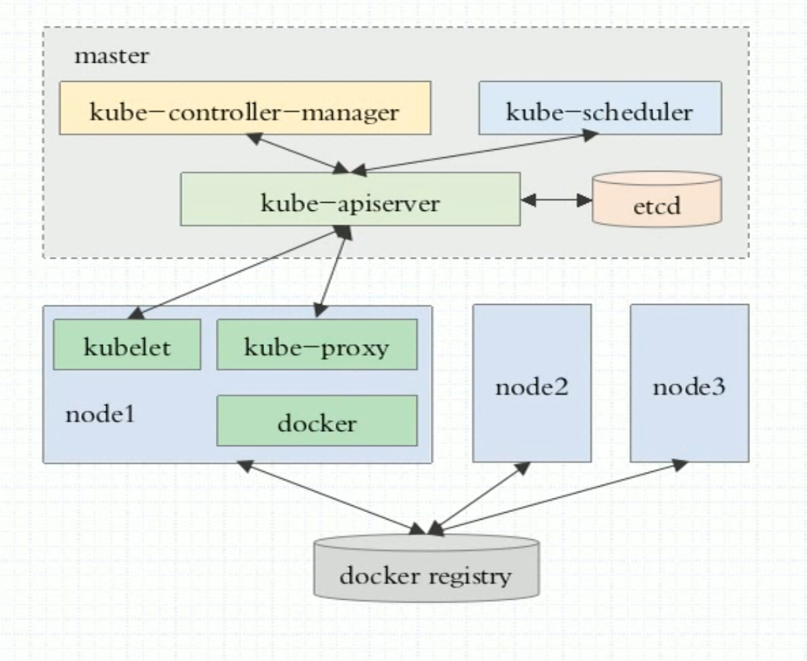
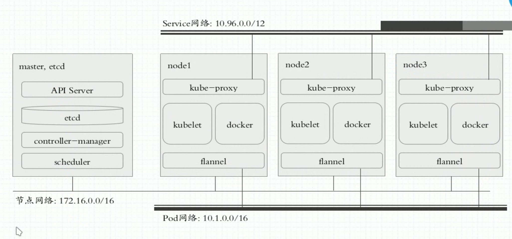
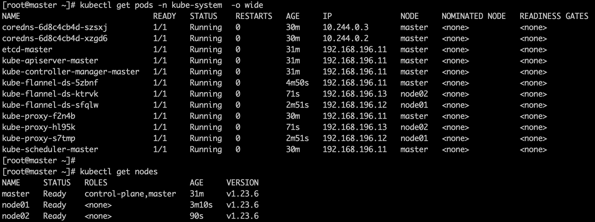
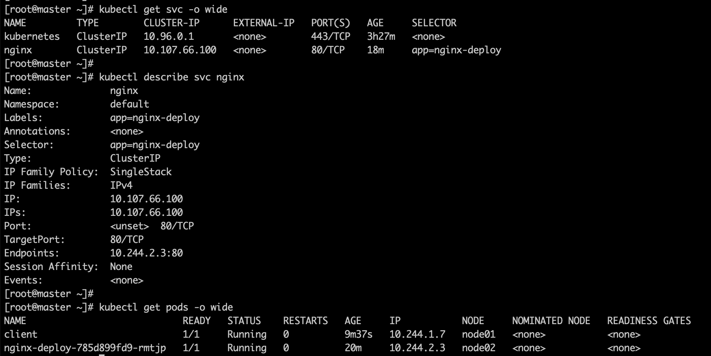
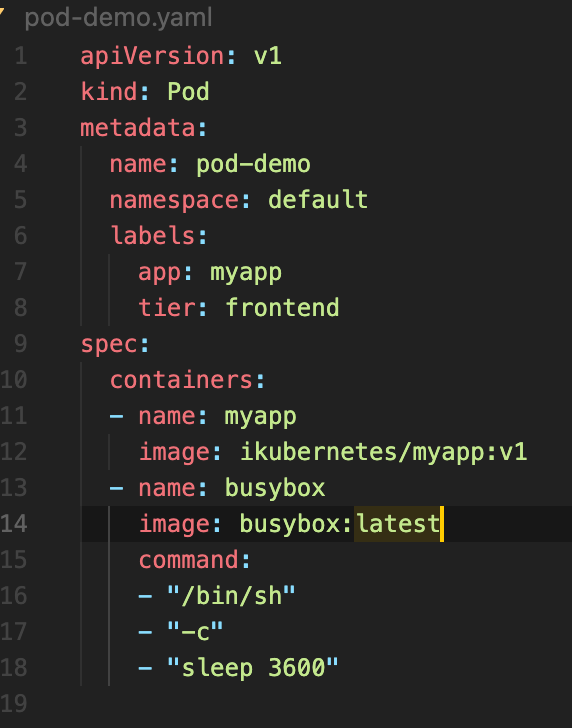
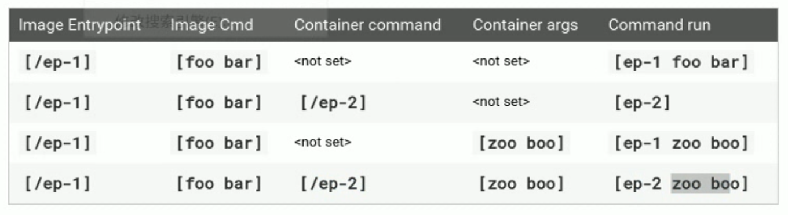
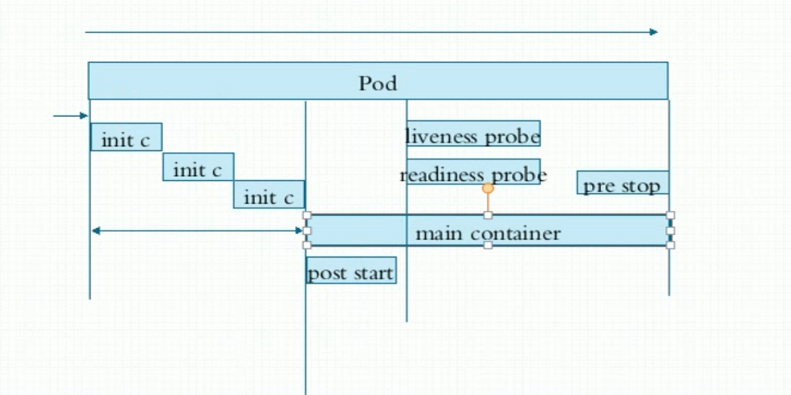
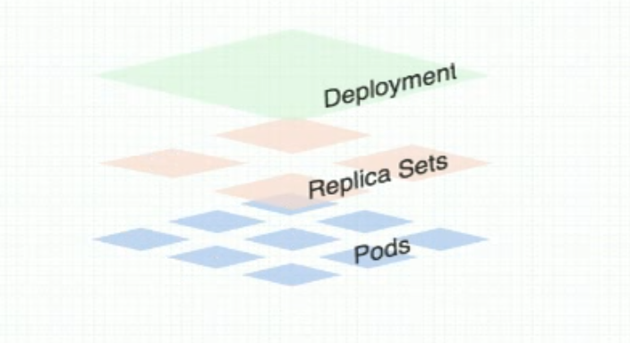

# **马哥k8s**

# 1 概要
## 1.1 组件

### 1.2 网络


# 2 kubeadmin安装k8s
## 2.1 环境
* 系统：centos7
* 关闭防火墙
* 关闭swap
### 2.1.1 服务器信息
````
vim /etc/hosts  # 修改如下
192.168.196.11 master
192.168.196.12 node01
192.168.196.13 node02

vim /etc/resolv.conf  # 修改如下
search magedu.com
````

## 2.2 安装yum软件
* docker-ce
* kubeadm
* kubelet
* kubectl  # 客户端程序(node可以不安装)

### 2.2.1 docker yum配置和安装 
#### [阿里文档](https://developer.aliyun.com/mirror/docker-ce?spm=a2c6h.13651102.0.0.3e221b11c9NoqD)  
```
# step 1: 安装必要的一些系统工具
yum install -y yum-utils device-mapper-persistent-data lvm2
# Step 2: 添加软件源信息
yum-config-manager --add-repo https://mirrors.aliyun.com/docker-ce/linux/centos/docker-ce.repo
# Step 3
sed -i 's+download.docker.com+mirrors.aliyun.com/docker-ce+' /etc/yum.repos.d/docker-ce.repo
# Step 4: 更新并安装Docker-CE
yum makecache fast
yum -y install docker-ce
# Step 4: 开启Docker服务，并设置开机启动
service docker start
systemctl enable docker
```
#### 配置国内镜像
```
vim /etc/docker/daemon.json
{
  "exec-opts": ["native.cgroupdriver=systemd"],
  "registry-mirrors": [
      "http://hub-mirror.c.163.com",
      "https://docker.mirrors.ustc.edu.cn"
  ]
}

重新加载配置
systemctl daemon-reload
systemctl restart docker
```

### 2.3.2 k8s yum配置和安装
[阿里源文档](https://developer.aliyun.com/mirror/kubernetes?spm=a2c6h.13651102.0.0.3e221b11c9NoqD)
```
新增yum配置(两个gpgcheck改成0)
cat <<EOF > /etc/yum.repos.d/kubernetes.repo
[kubernetes]
name=Kubernetes
baseurl=https://mirrors.aliyun.com/kubernetes/yum/repos/kubernetes-el7-x86_64/
enabled=1
gpgcheck=0
repo_gpgcheck=0
gpgkey=https://mirrors.aliyun.com/kubernetes/yum/doc/yum-key.gpg https://mirrors.aliyun.com/kubernetes/yum/doc/rpm-package-key.gpg
EOF

安装软件
yum install -y kubelet kubeadm kubectl

开机启动kubelet，不需要启动  
systemctl enable kubelet
```
## 2.4 安装master
### 2.4.1 kubeadm init初始化master  
[kubeadm init参考](https://k8s.easydoc.net/docs/dRiQjyTY/28366845/6GiNOzyZ/nd7yOvdY)

安装前查看
```
查看kueadm默认配置，imageRepository是镜像拉取地址
kubeadm config print init-defaults

查看需要的镜像
kubeadm config images list 
```

开始安装
```
kubeadm init --pod-network-cidr=10.244.0.0/16 --image-repository=registry.aliyuncs.com/google_containers
```
注：如果不指定pod-network-cidr，安装flannel网络后，会有问题

最后需要使用普通用户做一些配置，本次使用root
```
mkdir -p $HOME/.kube
cp -i /etc/kubernetes/admin.conf $HOME/.kube/config
```

记录node加入集群命令，给node加入集群使用
```
kubeadm join 192.168.196.11:6443 --token wukhpw.nhdvbxumw9j5l54z --discovery-token-ca-cert-hash sha256:7b359813c95747b3bf82b819d196b133bf55c8e183aadb749d6fd95f3c837ceb
```

查看状态
```
kubectl get cs  # 查看组件状态
kubectl get nodes  # 获取节点信息
kubectl get ns  # 查看名称空间
```
## 2.5 安装flannel网络
不安装的话nodes状态为NoReady

[flannel文档](https://github.com/flannel-io/flannel)

运行命令，进行安装
```
kubectl apply -f https://raw.githubusercontent.com/flannel-io/flannel/master/Documentation/kube-flannel.yml
```

查看命令
```
看到kube-flannel-ds... 表示安装好了
kubectl get pods -n kube-system  -o wide

过一会，node状态为Ready
kubectl get nodes
```



## 2.6 添加node到集群
```
kubeadm join 192.168.196.11:6443 --token wukhpw.nhdvbxumw9j5l54z --discovery-token-ca-cert-hash sha256:7b359813c95747b3bf82b819d196b133bf55c8e183aadb749d6fd95f3c837ceb
```

## 2.7 问题排查
一般情况下，问题出在pod本身，我们可以按照如下步骤进行分析定位问题
* kubectl get pod  查看是否存在不正常的pod
* journalctl -u kubelet -f 查看kubelet，是否存在异常日志
* kubectl logs -n kube-system -f pod/xxxxx
  * 比如 kubectl logs -f kube-scheduler-master -n kube-system

# 3 kubectl命令快速入门
### 3.1 创建deployment
```
dry-run表示不会具体执行
kubectl create deployment nginx-deploy --image=nginx:1.14-alpine --port=80 --dry-run=client

kubectl create deployment nginx-deploy --image=nginx:1.14-alpine --port=80
```
查看deployment
```
kubectl get deployment
kubectl get deployment -w  # 时时刷新 watch
```
查看pod lable信息
```
kubectl get pods --show-labels
```
### 3.2 创建service
```
deployment类型的service
kubectl expose deployment nginx-deploy --name=nginx --port=80 --target-port=80 --protocol=TCP
or: kubectl expose deployment nginx-deploy --name=nginx

pod类型的service
kubectl expose pod client --name=client-svc --port=81 --target-port=80 --protocol=TCP
```
#### 查看service
```
kubectl get svc -o wide
```
#### 解析service nginx的dns ip
```
dig -t A nginx.default.svc.cluster.local @10.96.0.10

10.96.0.10是通过下面命令获取的
kubectl get svc -n kube-system -o wide
```
#### 创建一个pod，这个是用来测试的
```
kubectl run client --image=xiaopeng163/net-box --restart=Never -it sh

or:
kubectl run client --image=busybox -it --restart=Never

测试是否能访问service nginx
wget nginx
or: wget -O - -q http://nginx:80
or: telnet nginx 80
or: nc -vz nginx 80
```
busybox中一些测试命令
```
nc -l -p 80  # 监听80端口
nc -vz nginx 80  # 测试端口连通性
  or: nc nginx 80
```
service信息


### 3.3 scale扩容缩减pod
```
创建deployment
kubectl create deployment myapp --image=ikubernetes/myapp:v1 --replicas=2

查看deployment状态
kubectl get deployment -w

客户端访问
wget -O - -q 10.244.2.5/hostname.html

创建service
kubectl expose deployment myapp --name=myapp --port=80

客户端访问service
while true;do wget -O - -q myapp/hostname.html;sleep 1;done

scale扩展到5个pod
kubectl scale --replicas=5 deployment myapp

scale缩减到3个pod
kubectl scale --replicas=3 deployment myapp

更新镜像
  先查看pod的容器名字
  kubectl describe pod myapp-9cbc4cf76-2rl2z
kubectl set image deployment myapp myapp=ikubernetes/myapp:v2

查看进度
kubectl rollout status deployment myapp

回滚到上一个版本
kubectl rollout undo deployment myapp
```
### 3.4 edit编辑service
```
kubectl edit svc myapp

比如修改type的ClusterIP为NodePort
```

# 4 k8s资源清单定义入门
## 资源定义例子


## 资源
* apiVersion
* kind
* metadata
* spec
查看apiveriosn
```
kubectl api-versions
```
## 资源帮助
```
kubectl explain pods
特定字段
kubectl explain pods.metadata
kubectl explain pods.metadata.name
```
## 创建和删除资源
```
kubectl create -f pod-demo.yaml
kubectl delete -f pod-demo.yaml
```
##排查命令
```
查看log
kubectl logs -f pod-demo myapp

进入容器
kubectl exec -it pod-demo myapp -- sh

获取pod信息，以yaml格式显示
kubectl get pod POD -o yaml
```

# 5 资源配置清单
## 5.1 资源的清单格式(一级清单)
* apiVersion(group/version)
* kind
* metadata
* status(只读)
## 5.2 Pod资源
### 修改镜像中的默认应用
[文档](https://kubernetes.io/docs/tasks/inject-data-application/define-command-argument-container/)

## 5.3 标签label
### 查看pod时显示标签
```
kubectl get pods --show-labels
```
### 修改标签
```
添加pod标签
kubectl label pod pod-demo release=canary --overwrite
添加node标签
kubectl label node node01 disk=ssd
```
### 标签定义
```
key=value
key: 长度63，字母/数字/_-、.，有前缀的话最长253
value: 长度63，可以使空值，字母数字_-、.，只能字母数字开头结尾
```
### kubectl命令，-l参数标签选择器
```
等值关系：= == !=
集合关系：
  KEY in (VALUE1, VALUE2)
  KEY notin (VALUE1, VALUE2)
  KEY
  !KEY

例子：
kubectl get pods -l release=stable
kubectl get pods -l "release in (stable, canary)"
```
### 资源yaml定义时，标签选择器
```
matchLabels: 直接给定键值
matchExpressions: 基于给定的表达式来定义使用标签选择器，{key:"KEY",operator:"OPERATOR",values:["VAL1","VAL2",...]}
  操作符:
    IN NotIn: values字段的值必须为非空列表
    Exists NotExists: value字段必须为空列表

例子：
spec:
  selector:
    matchLabels:
      app: redis
      role: logstor
```
### 节点标签选择器
```
spec下面定义，和containers同级，选择有特定标签的node
nodeSelector <map[string]string> 节点选择器
nodeSelector:
  disk: ssd

nodename <sting>  指定特定node
```

# 6 Pod生命周期

### 健康状态检测 livenessProbe
```yaml
apiVersion: v1
kind: Pod
metadata:
  name: liveness-pod
  namespace: default
spec:
  containers:
  - name: busybox
    image: busybox:latest
    imagePullPolicy: IfNotPresent
    command: ['/bin/sh', '-c', 'touch /tmp/health; sleep 30; rm -f /tmp/health; sleep 3600']
    livenessProbe:
      initialDelaySeconds: 2
      periodSeconds: 3
      exec:
        command: ['test', '-e', '/tmp/health']
```
### 就绪状态检测 readinessProbe
```yaml
apiVersion: v1
kind: Pod
metadata:
  name: readiness-pod
  namespace: default
spec:
  containers:
  - name: busybox
    image: busybox:latest
    imagePullPolicy: IfNotPresent
    command: ['/bin/sh', '-c', 'touch /tmp/health; sleep 30; rm -f /tmp/health; sleep 3600']
    readinessProbe:
      initialDelaySeconds: 2
      periodSeconds: 3
      exec:
        command: ['test', '-e', '/tmp/health']
```
### 容器启动后运行postStart
```yaml
apiVersion: v1
kind: Pod
metadata:
  name: poststart-pod
  namespace: default
spec:
  containers:
  - name: busybox
    image: busybox:latest
    imagePullPolicy: IfNotPresent
    lifecycle:
      postStart:
        exec:
          command: ['/bin/sh', '-c', 'echo 123 >> /index.html']
    command: ['/bin/sh', '-c', 'httpd -h / && tail -f /dev/null']
```
测试
```
curl POD_IP  # 可以看到123
```
# 7 控制器
## Deployment结构


### ReplicaSet

### Deployment


#### patch打补丁更新

### 实验：通过filebeat传日志给reids，通过service的主机名通信，filebeat运行在每个node
#### 创建Deployment和DaemonSet
```yaml
apiVersion: apps/v1
kind: Deployment
metadata:
  name: redis
  namespace: default
spec:
  replicas: 1
  selector:
    matchLabels:
      app: redis
      role: logstor
  template:
    metadata:
      labels:
        app: redis
        role: logstor
    spec:
      containers:
      - name: redis
        image: redis:4.0-alpine
        ports:
        - name: redis
          containerPort: 6379
---
apiVersion: apps/v1
kind: DaemonSet
metadata:
  name: filebeat-ds
  namespace: default
spec:
  selector:
    matchLabels:
      app: filebeat
      release: stable
  template:
    metadata:
      labels:
        app: filebeat
        release: stable
    spec:
      containers:
      - name: filebeat
        image: ikubernetes/filebeat:5.6.5-alpine
        env:
        - name: REDIS_HOST
          value: redis.default.svc.cluster.local
        - name: REDIS_LOG_LEVEL
          value: info
```
#### 创建service
```
kubectl expose deployment redis --port=6379
```
#### 查看filebeat pod，在每个node
````
[root@master ~]# kubectl get pods -l app=filebeat -o wide
NAME  READY STATUS RESTARTS AGE IP NODE NOMINATED NODE READINESS GATES
filebeat-ds-85qqq 1/1 Running 0 31m 10.244.2.39 node02 <none> <none>
filebeat-ds-p4spt 1/1 Running 0 31m 10.244.1.33 node01 <none> <none>
```