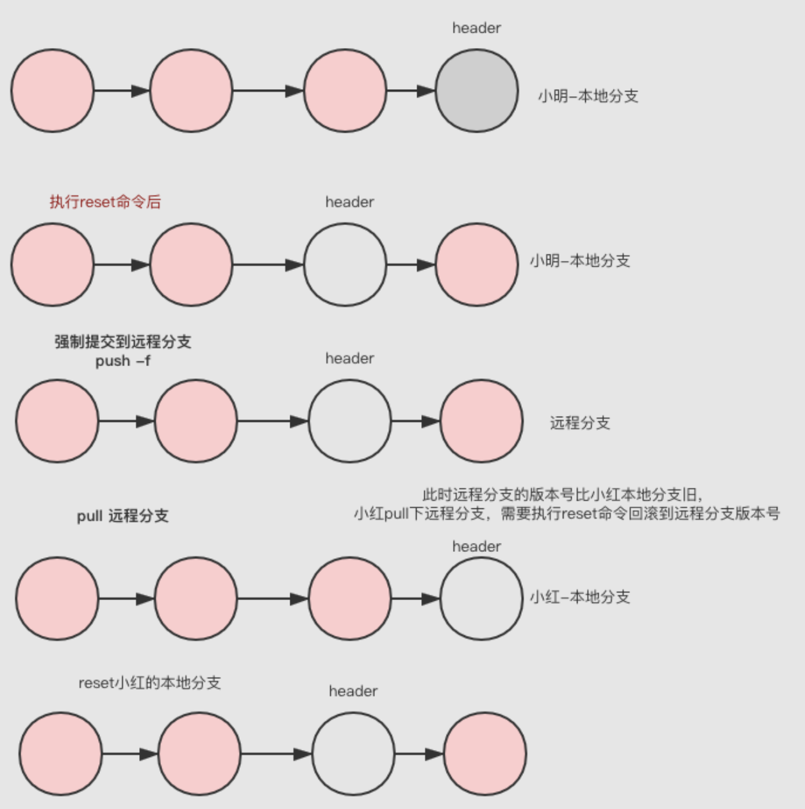

# git配置

## 全局配置
* 查看配置 git config --global -l
* 换行 windows系统下拉取代码换行符是linux的格式LF
  * git config --global core.autocrlf false
* git名字
  * git config --global user.name zhouge
* 邮箱 
  * git config --global user.email abc@email.com

## 回滚远程分支
### [教程](https://www.jianshu.com/p/b7498be122da)
### 命令
```
# 获取将要回滚到的版本号
git log [--pretty=oneline --abbrev-commit]# 回滚提交（本地回滚）
git reset --hard commentId
# 强制提交到远程分支
git push -f [origin xxx]
```

### 需要通知同分支的开发人员

* 本地使用reset回退版本；
* 强行push -f到远程；
* 同事使用pull命令拉取服务器代码；
* 所有同事本地都要使用reset来回退版本；


## 本地代码上传到新gitlab项目
* gitlab创建新项目
* 本地运行下面命令
```
git init
git add .
git commit -m "first commit"
git remote add origin git@github.com:samzhouge/learngo.git
git push -u origin master
```
