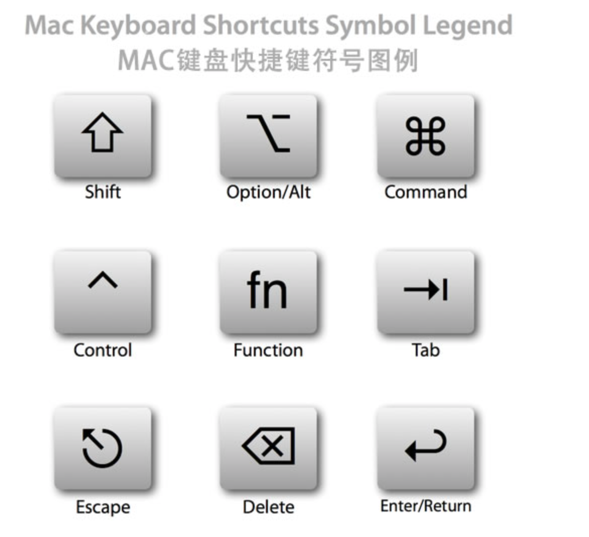

# MscOS快捷键
### Mac 快捷键

* [x] 切换窗口 control tab
* 删除 delete
* 右删除 fn delete
* Home fn ←
* End fn →
* Page Up fn ↑
* Page Down fn ↓
* 切换桌面 control ↑↓←→

### Shortcuts 捷径
* [x] 最近修改过的名字 command e
* 重命名 shift F6

### General 常用
* [x] 切换窗口 alt →
* [x] 设置 command ,
* 折叠左边目录树 command 1 
* 书签栏 command 2
* 定位文件所在目录树 alt F1

### Usage Search 变量搜索
* 哪些地方使用到 command F7

### Editing 文本编辑
* [x] 完成语句，自动会加{}等 command shift enter
* 调整一行位置 command shift ↑
* 删除一行 control y/command delete(mac)
* 删除至单词结尾 alt delete
* 删除至单词开头 alt fn delete
* 查看文档 control j
* 查看参数 command p
* 大小写切换 command shift u
* 查看最近复制 command shift v
* 关闭当前编辑窗口 command w
* 收缩展开代码 command -/+
* 嵌入代码块(如if else) command alt t

## Navigation 导航
* [x] 快速查看定义的内容 alt space
* [x] 文件结构弹框 command F12
* 跳转窗口 command alt →
* 书签 
  * 设置书签 F3
  * 助记符标签 alt F3
    * 跳转到助记标签 control 1(这个是助记符)
  * 展示助记 command F3
* 跳转到最后的编辑位置 command shift delete
* 进入源码 command ↓|F4
* 跳转到编辑 esc
* 跳转到某行 command l

# Windows快捷键
---
## [GoLand常用快捷键](https://blog.51cto.com/quantfabric/2294263)
## 查看
* CTRL+Q 显示注释文档CTRL+SHIFT+I 简短查看源定义

## 自动代码
* [x] CTRL+ALT+V 自动生成表达式返回值（比如v,err=func()）
* ALT+INSERT 生成代码(如GET,SET方法,构造函数等)
* CTRL+I 实现接口
* [x] 自定义模板
  * 转到 Preferences | Editor | Live Templates，并点击 +，新增动态模板

# Keymap
* 自定义光标跳转行尾
  * 行尾 ctrl ;
  * 行首 ctrl shift ;
