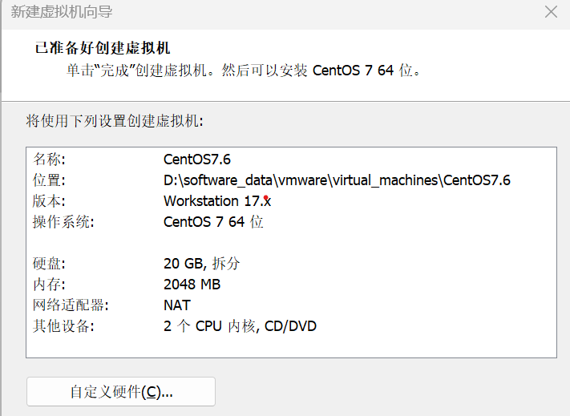

## vmware安装centos7
* 创建新的虚拟机
* 典型
* 稍后安装操作系统
* 选择客户操作系统：Linux CentOS7 64 位
* 虚拟机名：CentOS7.6
* 自定义硬件
  * 新 CD/DVD选择ISO文件
  * 内存：2G
  * CPU：2
  * 网络适配器：NAT
  * 删除：USB/声卡/打印机设备等不需要要的设备
  
* 开始安装
  * 最小化安装
  * root CentOS7!@#

## 修改时区

## 修改时间

## 修改主机名