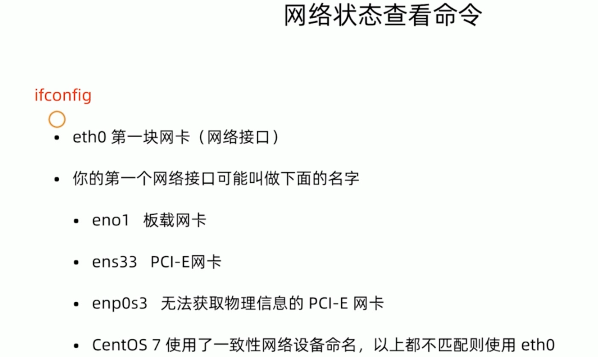
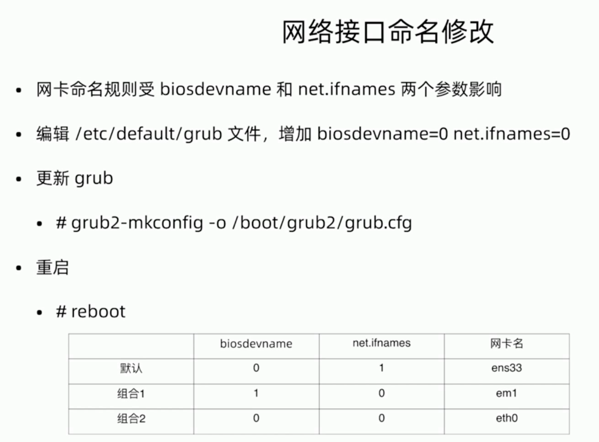
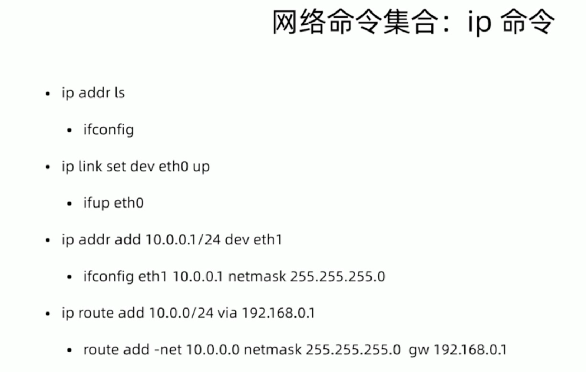

## net-tools VS iproute
### net-tools
- ifconfig
- route
- netstat
### iproute2
- ip
- ss
## 查看网络状态命令

## 网卡接口命名修改

### 安装系统前
- 开始安装时候，按Tab键，修改网卡显示名eth0，在最下面quiet后面追加
    - net.ifnames=0 biosdevname=0
### 安装系统后
```
1、修改 /etc/sysconfig/network-scripts/ifcfg-ens33
NAME=eth0
DEVICE=eht0
2、重命名网卡文件
mv /etc/sysconfig/network-scripts/ifcfg-ens33 /etc/sysconfig/network-scripts/ifcfg-eth0
3、编辑grub，在quit后面添加 biosdevname=0 net.ifnames=0
4、运行 grub2-mkconfig -o /boot/grub2/grub.cfg
5、重启
```
## 命令
- 查看单块网卡信息 ifconfig ens33
- 查看网卡物理连接情况 mii-tool ens33
- 查看网关 route -n  # -n 不解析主机名
- 网卡配置
  - ifconig <接口> <ip地址> [netmask 子网掩码]
    - ifconfig eth0 10.0.0.1 netmask 255.255.255.0
  - ifup <接口>
  - ifdown <接口>
- 网关配置
  - 添加网关
    - route add default gw <网关ip>  # 需要先删除网关 
    - route add -host <指定ip> gw <网关ip>
      - route add -host 20.0.0.2 gw 20.0.0.1
    - route add -net <指定网段> netmask <子网掩码> gw <网关ip>
      - route add -net 192.168.196.0 netmask 255.255.255.0 gw 10.0.0.5
  - 删除网关
    - route del default gw 10.0.0.1


