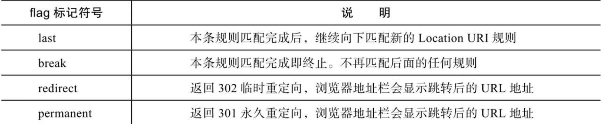

# **nginx基础**

# nginx配置
## location
### location语法
```location [=|~|~*|^~] url {}```
- ~|~* 正则表达式（不匹配大小写|匹配大小写）
- ^~ 不做正则匹配
- !取反
- 优先级 = > ^~ > 其他


## rewrite

* alias 必须使用last
* proxy_pass 使用break
* last执行完成rewrite后，会对所在的server{...}标签重新发请求


