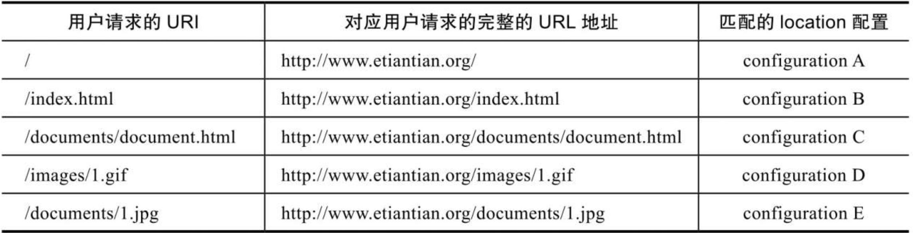
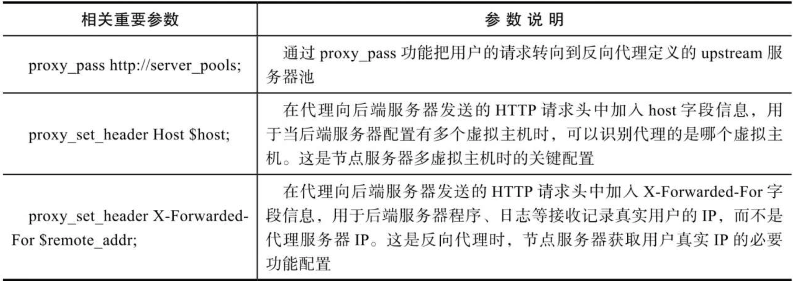

# **nginx基础**

# nginx配置
## location
### location语法
```location [=|~|~*|^~] url {}```
- ~|~* 正则表达式（不匹配大小写|匹配大小写）
- ^~ 不做正则匹配
- !取反
- 优先级 = > ^~ > 其他
### 例子
```          
    location = / {
        [ configuration A ]
    }
    location / {
        [ configuration B ]
    }
    location /documents/ {
        [ configuration C ]
    }
    location ^~ /images/ {
        [ configuration D ]
    }
    location ~＊ \.(gif|jpg|jpeg)$ {
        [ configuration E ]
    }
```


## rewrite

* alias 必须使用last
* proxy_pass 使用break
* last执行完成rewrite后，会对所在的server{...}标签重新发请求

### 格式
```rewrite ^/(.＊) http://www.etiantian.org/$1 permanent;```
### 例子1
```
etiantian.org跳转到www.etiantian.org

[root@web01 extra]# cat 01_www.conf
    server {
        listen         80;
        server_name   etiantian.org;
            rewrite ^/(.＊) http://www.etiantian.org/$1 permanent;
            #<==当用户访问etiantian.org及下面的任意内容时，都会通过这条Rewrite跳转到www.etiantian.org对应的地址。
    }

    server {
        listen         80;
        server_name   www.etiantian.org;
        location / {
            root    html/www;
            index   index.html index.htm;
        }
        access_log logs/access_www.log main gzip buffer=32k flush=5s;
    }
```
### 例子2
```
实现访问http://blog.etiantian.org跳转到http://www.etiantian.org/blog/oldboy.html。

跳转前http://blog.etiantian.org对应站点的配置如下：
[root@web01 extra]# cat 03_blog.conf
    server {
        listen         80;
        server_name   blog.etiantian.org;
        location / {
            root    html/blog;
            index   index.html index.htm;
        }
        if ( $http_host ~＊ "^(.＊)\.etiantian\.org$") {
            set $domain $1;
            rewrite ^(.＊) http://www.etiantian.org/$domain/oldboy.html break;
            }
    }

跳转后http://www.etiantian.org/blog/oldboy.html地址对应的站点配置如下：
[root@web01 extra]# cat 01_www.conf
    server {
        listen         80;
        server_name   www.etiantian.org etiantian.org;
        location / {
            root    html/www;
            index   index.html index.htm;
        }
        access_log logs/access_www.log main gzip buffer=32k flush=5s;
    }
```

### 例子3
```
需要实现访问http://www.etiantian.org/bbs跳转到http://bbs.etiantian.org。

[root@web01 extra]# cat 01_www.conf
    server {
        listen         80;
        server_name   www.etiantian.org etiantian.org;
        location / {
            root    html/www;
            index   index.html index.htm;
        }
        rewrite ^(.＊)/bbs/ http://bbs.etiantian.org break;
        access_log logs/access_www.log main gzip buffer=32k flush=5s;
    }
[root@web01 extra]# cat 02_bbs.conf
    server {
        listen         80;
        server_name   bbs.etiantian.org;
        location / {
            root    html/bbs;
            index   index.html index.htm;
        }
    }
```

### 注意
* 有关Rewrite特殊flag标记last与break的说明：在根location（即location /{……}）中或者server{……}标签中编写Rewrite规则，建议使用last标记，而在普通的Location（例location /oldboy/{……}或if{}中编写Rewrite规则，则建议使用break标记。

## 反向代理

### 例子
```
[root@lb01 conf]# cat nginx.conf
worker_processes   1;
events {
    worker_connections   1024;
}
http {
    include         mime.types;
    default_type   application/octet-stream;
    sendfile          on;
    keepalive_timeout   65;
    upstream www_pools {                   #<==这里是定义Web服务器池，包含了9、10两个Web节点。
        server 10.0.0.7:80   weight=1;
        server 10.0.0.8:80   weight=1;
    }
    server {                                 #<==这里是定义代理的负载均衡域名虚拟主机。
        listen         80;
        server_name   www.etiantian.org;
        location / {
            proxy_pass http://www_pools;     #<==访问www.etiantian.org，请求发送给www_pools里面的节点。
        }
    }
}
```

### upstream例子
```
upstream blog_pools {
    server   10.0.0.7;    #<==这一行标签和下一行是等价的。
    server    10.0.0.8:80 weight=1 max_fails=1 fail_timeout=10s;
    #<==这一行标签和上一行是等价的，此行多余的部分就是默认配置，不写也可以。
    server    10.0.0.9:80 weight=1 max_fails=2 fail_timeout=20s backup;
    server    10.0.0.10:80 weight=1 max_fails=2 fail_timeout=20s backup;
}

upstream backend {
    server backend1.example.com weight=5;
    server backend2.example.com:8080;    #<==域名加端口。转发到后端的指定端口上。
    server unix:/tmp/backend3;            #<==指定socket文件。
#提示：server后面如果接域名，需要内网有DNS服务器或者在负载均衡器的hosts文件做域名解析。
    server backup1.example.com:8080    backup;
#<==结尾backup表示备份服务器，其他指定服务器都不可访问时启用，backup的用法和Haproxy
    中用法一样。
    server backup2.example.com:8080    backup;
}

upstream backend {
    server backend1.example.com      weight=5;    #<==如果就是单个Server，没必要设置权重。
    server 127.0.0.1:8080              max_fails=5 fail_timeout=10s;
#<==当检测次数等于5的时候，5次连续检测失败后，间隔10s再重新检测，这个参数和proxy/fastcgi/memcached_next_upstream相关。
    server unix:/tmp/backend3;
    server backup1.example.com:8080 backup;      #<==热备机器设置。
}

ip_hash算法
需要特别说明的是，如果是Nginx代理cache服务，可能需要使用hash算法，此时若宕机，可通过设置down参数确保客户端用户按照当前的hash算法访问，这点很重要。
注意：当负载调度算法为ip_hash时，后端服务器在负载均衡调度中的状态不能写入weight和backup两个参数，即使有也不会生效。
upstream backend {
    ip_hash;
    server backend1.example.com;
    server backend2.example.com;
    server backend3.example.com down;
    server backend4.example.com;
}
```
### upstream模块内部server标签参数说明


### 负载算法
* rr（默认调度算法，静态调度算法）
* wrr（权重轮询，静态调度算法）
  * 在rr轮询算法的基础上加上权重，即为权重轮询算法，当使用该算法时，权重和用户访问成正比，权重值越大，被转发的请求也就越多。
* ip_hash（静态调度算法）
  * 注意：当负载调度算法为ip_hash时，后端服务器在负载均衡调度中的状态不能写入weight和backup两个参数，即使有也不会生效。
* fair（动态调度算法）
  * 此算法会根据后端节点服务器的响应时间来分配请求，响应时间短的优先分配。这是更加智能的调度算法。此种算法可以依据页面大小和加载时间长短智能地进行负载均衡，也就是根据后端服务器的响应时间来分配请求，响应时间短的优先分配。Nginx本身是不支持fair调度算法的，如果需要使用这种调度算法，必须下载Nginx的相关模块upstream_fair。
* url_hash算法（动态调度算法）
  * 和ip_hash类似，这里是根据访问URL的hash结果来分配请求的，让每个URL定向到同一个后端服务器，后端服务器为缓存服务器时效果显著。在upstream中加入hash语句，server语句中不能写入weight等其他的参数，hash_method使用的是hash算法。
* 一致性hash算法（动态调度算法
  * 一致性hash算法一般用于代理后端业务为缓存服务（Squid、Memcached）的场景，通过将用户请求的URI或者指定字符串进行计算，然后调度到后端的服务器上，此后任何用户查找同一个URI或者指定字符串都会被调度到这一台服务器上，因此后端的每个节点缓存的内容都是不同的，一致性hash算法可以使后端某个或几个节点宕机后缓存的数据动荡的最小。

```
**wrr**
upstream oldboy_lb {
    server 192.168.1.2 weight=1;
    server 192.168.1.3 weight=2;
}

**ip_hash**
upstream oldboy_lb {
    ip_hash;
    server 192.168.1.2:80;
    server 192.168.1.3:8080;
}
upstream backend {
    ip_hash;
    server backend1.example.com;
    server backend2.example.com;
    server backend3.example.com down;
    server backend4.example.com;
}

**fair**
upstream oldboy_lb {
    fair;
    server 192.168.1.2;
    server 192.168.1.3;
}

**url_hash**
upstream oldboy_lb {
    server squid1:3128;
    server squid2:3128;
    hash $request_uri;
    hash_method crc32;
}

**consistent_hash**
http {
    upstream test {
        consistent_hash $request_uri;
        server 127.0.0.1:9001 id=1001 weight=3;
        server 127.0.0.1:9002 id=1002 weight=10;
        server 127.0.0.1:9003 id=1003 weight=20;
    }
}
```
### proxy_pass指令
proxy_pass指令属于ngx_http_proxy_module模块，此模块可以将请求转发到另一台服务器，在实际的反向代理工作中，会通过location功能匹配指定的URI，然后把接收到的符合匹配URI的请求通过proxy_pass抛给定义好的upstream节点池。

```
location /name/ {
    proxy_pass http://127.0.0.1/remote/;
}

将匹配URI为name的请求应用指定的rewrite规则，然后抛给http://127.0.0.1。
location /name/ {
    rewrite     /name/([^/]+) /users?name=$1 break;
    proxy_pass http://127.0.0.1;
}
```
#### http_proxy_module相关参数

### Nginx负载均衡反向代理相关实践
#### 例子1 利用upstream定义一组WWW服务器池
```
[root@lb01 conf]# cat nginx.conf
worker_processes   1;
events {
    worker_connections   1024;
}
http {
    include         mime.types;
    default_type   application/octet-stream;
    sendfile          on;
    keepalive_timeout   65;
    upstream www_pools {
        server 10.0.0.7:80   weight=1;
        server 10.0.0.8:80   weight=1;
    }
    server {
        listen         80;
        server_name   www.etiantian.org;
        location / {
        proxy_pass http://www_pools;

        proxy_set_header Host   $host;
        #<==在代理向后端服务器发送的HTTP请求头中加入host字段信息，用于当后端服务器配置有多个虚拟主机时识别代理的是哪个虚拟主机。这是节点服务器多虚拟主机时的关键配置。

        proxy_set_header X-Forwarded-For $remote_addr;
        #<==在代理向后端服务器发送的HTTP请求头中加入X-Forwarded-For字段信息，用于后端服务器程序、日志等接收记录真实用户的IP，而不是代理服务器的IP。
        }
    }
}
```

nginx web服务器日志格式添加http_x_forwarded_for，实际客户端ip。remote_addr显示的是反向代理nginx的ip。
```
[root@web01~]# cat /application/nginx/conf/nginx.conf
worker_processes   1;
events {
        worker_connections   1024;
}
http {
    include         mime.types;
    default_type   application/octet-stream;
    sendfile          on;
    keepalive_timeout   65;
    log_format   main   '$remote_addr - $remote_user [$time_local] "$request" '
                        '$status $body_bytes_sent "$http_referer" '
                        '"$http_user_agent" "$http_x_forwarded_for"';
#<==就是这里的"$http_x_forwarded_for"’参数，如果希望在第一行显示，可以替换掉第一行的
    $remote_addr变量。
    server {
        listen         80;
        server_name   bbs.etiantian.org;
        location / {
            root    html/bbs;
            index   index.html index.htm;
        }
        access_log   logs/access_bbs.log   main;
    }
    server {
        listen         80;
        server_name   www.etiantian.org;
        location / {
            root    html/www;
            index   index.html index.htm;
        }
        access_log   logs/access_www.log   main;
    }
}
```
#### 相关重要参数说明



